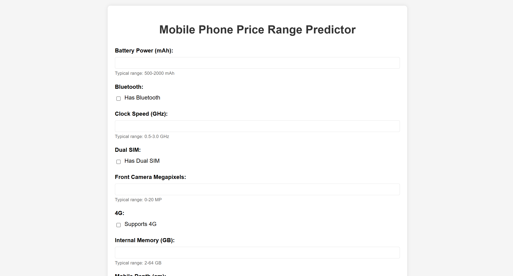

# 📱 Noise-Resilient Mobile Price Classification
### Demo Video

## 🌐 Overview
In the ever-competitive mobile industry where giants like Apple and Samsung dominate, starting a mobile company presents unique challenges. One of the pivotal challenges is estimating the right price for the mobile phones. In this project, we harness sales data from various companies aiming to discern a relationship between mobile features, such as RAM and internal memory, and its selling price. Our endeavor is not to predict the actual price but to discern a price range, allowing us to determine how high the price is likely to be. With the aid of machine learning, we aim to better estimate our mobile phones' pricing, positioning ourselves effectively against the competition.

## 🚩 Problem
We are starting our own mobile company and we want to compete with big players like Apple and Samsung. However, estimating the price of our mobile phones remains a challenge. By leveraging sales data from various companies, our aim is to identify relationships between different mobile phone features, such as RAM and internal memory, and its price range. This will help us not just predict the actual price, but also to ascertain a price range indicating the probable price band. Through machine learning, we intend to bolster our price estimation prowess, ensuring we compete effectively in the market.

## 🎯 Objectives
- **Exploring and Preprocessing Data**: Dive deep into the data, preparing it for subsequent steps.
- **Model Building**: Construct various classification models to predict the mobile phone price range.
  - Support Vector Machine (SVM)
  - Decision Tree (DT)
  - Random Forest (RF)
- **Prediction**: Price range prediction for 1000 unseen data samples.

## 📊 Dataset
The dataset encompasses a multitude of metrics related to mobile phone features. The features of the dataset are elaborated in the table below:

<table style="width:100%">
<thead>
<tr>
<th style="text-align:center; font-weight: bold; font-size:20px">Variable Name</th>
<th style="text-align:center; font-weight: bold; font-size:20px">Description</th>
</tr>
</thead>
<tbody>
<tr><td><b>
id
</b></td><td>ID</td></tr>
<tr><td><b>
battery_power
</b></td><td>Total energy a battery can store in one time measured in mAh</td></tr>
<tr><td><b>
blue
</b></td><td>Has bluetooth or not</td></tr>
<tr><td><b>
clock_speed
</b></td><td>Speed at which microprocessor executes instructions</td></tr>
<tr><td><b>
dual_sim
</b></td><td>Has dual sim support or not</td></tr>
<tr><td><b>
fc
</b></td><td>Front Camera mega pixels</td></tr>
<tr><td><b>
four_g
</b></td><td>Has 4G or not</td></tr>
<tr><td><b>
int_memory
</b></td><td>Internal Memory in Gigabytes</td></tr>
<tr><td><b>
m_dep
</b></td><td>Mobile Depth in cm</td></tr>
<tr><td><b>
mobile_wt
</b></td><td>Weight of mobile phone</td></tr>
<tr><td><b>
n_cores
</b></td><td>Number of cores of processor</td></tr>
<tr><td><b>
pc
</b></td><td>Primary Camera mega pixels</td></tr>
<tr><td><b>
px_height
</b></td><td>Pixel Resolution Height</td></tr>
<tr><td><b>
px_width
</b></td><td>Pixel Resolution Width</td></tr>
<tr><td><b>
ram
</b></td><td>Random Access Memory in Megabytes</td></tr>
<tr><td><b>
sc_h
</b></td><td>Screen Height of mobile in cm</td></tr>
<tr><td><b>
sc_w
</b></td><td>Screen Width of mobile in cm</td></tr>
<tr><td><b>
talk_time
</b></td><td>Longest time that a single battery charge will last when you are</td></tr>
<tr><td><b>
three_g
</b></td><td>Has 3G or not</td></tr>
<tr><td><b>
touch_screen
</b></td><td>Has touch screen or not</td></tr>
<tr><td><b>
wifi
</b></td><td>Has wifi or not</td></tr>
<tr><td><b>
price_range
</b></td><td>Price range (0 = low cost, 1 = medium cost, 2 = high cost, 3 = very high cost)</td></tr>
</tbody>
</table>

Access the dataset on Kaggle [here](https://www.kaggle.com/datasets/iabhishekofficial/mobile-price-classification).

## 📁 File Descriptions
- 📓 **`Noise-Resilient_Mobile_Price_Classification.ipynb`**: Jupyter notebook encapsulating the exploration, preprocessing, modeling, and evaluation stages.
- 📄 **`train.csv`**: CSV file containing the training data.
- 📄 **`test.csv`**: CSV file containing the test data.
- 📘 **`README.md`**: This very file you're reading! A guide to understanding the project.

## 🚀 How to Execute
1. Clone this repository to your local machine.
2. Launch the `Noise-Resilient_Mobile_Price_Classification.ipynb` notebook in Jupyter.
3. Execute all cells in the notebook.

## 🔗 Additional Resources
- **Kaggle Notebook**: Interested in a Kaggle environment? Check out the notebook [here](https://www.kaggle.com/parhamfarjam).
- **LinkedIn**: [Farzad Nekouei's Profile](https://www.linkedin.com/in/karim-farjam-a6b72549/)
